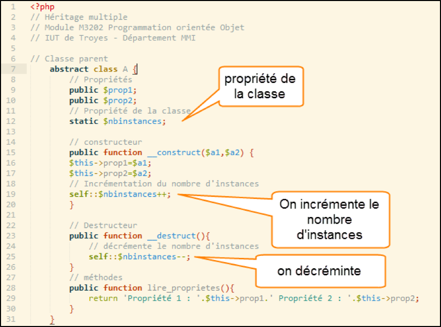
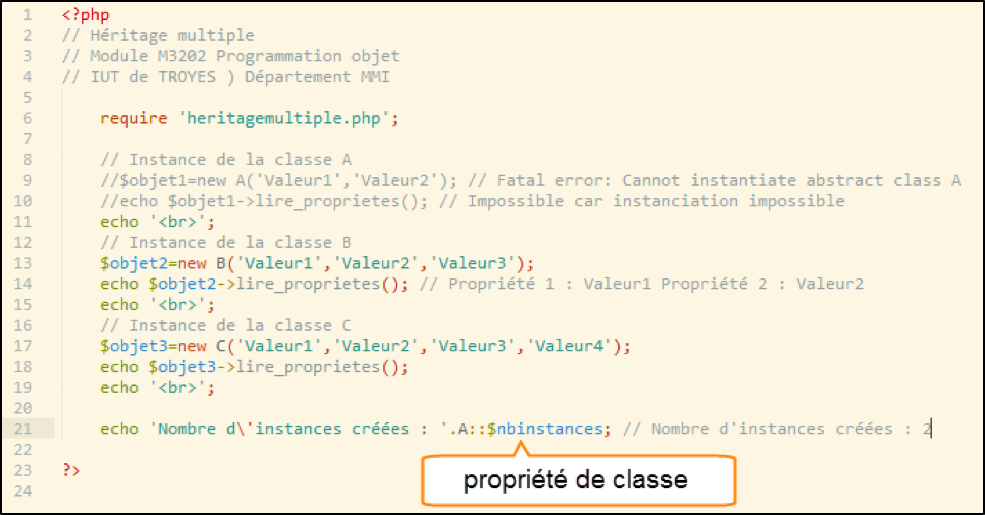
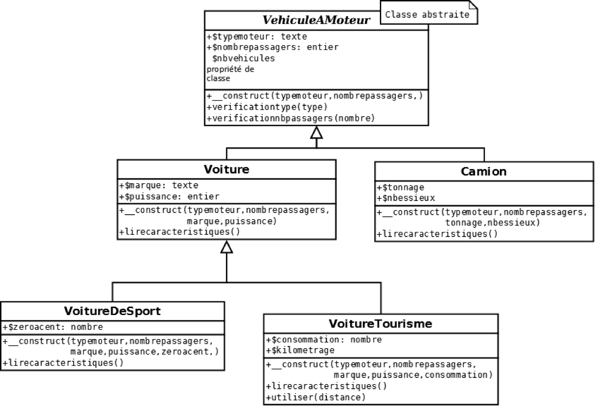

# Séance 6 : Héritage multiple

### Cours

#### Héritage multiple

L’héritage est le moyen de spécialiser une classe sans compromettre son code original. PHP autorise l’héritage multiple. Une classe pouvant être une classe fille mais aussi une classe parent. \(cf. exemple ci-dessous\)

```php
<?php
//exemple 1
//Source H. Boulet

//Classe Parent
abstract class A {

   //Propriétés
   public $prop1;
   public $prop2;

   // Propriété de la classe
   static $nbinstances;

   //constructeur
   public function__construct($a1, $a2)
   {
      $this->prop1 = $a1;
      $this->prop2 = $a2;

      //incrémentation du nombre d'instances
      self::$nbinstances++;
   }

   //destructeur
   public function __destruct()
   {
      //décrémente le nombre d'instances
      self::$nbinstances--;
   }

   public function lire_proprietes()
   {
      return 'Propriété 1 :'.$this->prop1.', Propriété 2 :'.$this->prop2;
   }
}

//Classe fille de A, mais aussi classe parent de C
class B extends A {

   //Propriétés
   public $prop3;

   //constructeur
   public function__construct($a1, $a2, $a3)
   {
      parent::__construct($a1, $a2);
      $this->prop3 = $a3;
   }
}

//Classe fille de B
final class C extends B {

   //Propriétés
   public $prop4;

   //constructeur
   public function__construct($a1, $a2, $a3, $a4)
   {
      parent::__construct($a1, $a2, $a3);
      $this->prop4 = $a4;
   }
}
```

Dans l'exemple ci-dessus, la classe B hérite de la classe A. La classe C hérite de la classe B.

#### Final

Evidemment l’héritage multiple a fonctionnellement des limites. On peut souhaiter interdire l’héritage afin de conserver une certaine intégrité du code. C’est possible si on place le mot clé final devant le nom de la classe. \(cf. exemple ci-dessous\)

```php
//Source H. Boulet

//Classe fille de B
final class C extends B {

   //Propriétés
   public $prop4;

   //constructeur
   public function__construct($a1, $a2, $a3, $a4)
   {
      parent::__construct($a1, $a2, $a3);
      $this->prop4 = $a4;
   }
}
```

Dans l'exemple ci-dessus, on ne pourra pas créer de classes à partir de la classe C. L’héritage est interdit.

#### Classe abstraite

une classe abstraite ne peut pas être instanciée. L’héritage devient alors le seul moyen pour exploiter ses propriétés et ses méthodes. Les classes filles pouvant alors être instanciées. \(cf. exemples ci-dessous\).

```php
//Source H. Boulet

//Classe Parent
abstract class A {

   //Propriétés
   public $prop1;
   public $prop2;

   // Propriété de la classe
   static $nbinstances;

   //constructeur
   public function__construct($a1, $a2)
   {
      $this->prop1 = $a1;
      $this->prop2 = $a2;

      //incrémentation du nombre d'instances
      self::$nbinstances++;
   }

   //destructeur
   public function __destruct()
   {
         //décrémente le nombre d'instances
         self::$nbinstances--;
   }

   public function lire_proprietes()
   {
      return 'Propriété 1 :'.$this->prop1.', Propriété 2 :'.$this->prop2;
   }
}
```

Classe abstraite, mot-clé abstract.

```php
<?php
//Exemple. Source H. Boulet

require 'heritagemultiple.php';

$objet1 = new 1('V1', 'V2'); //fatal error: Cannot instantiate abstract class A
echo $objet1->lire_proprietes(); //impossible car l'instanciation est impossible
```

Dans l'exemple ci-dessus, la classe A est abstraite. Elle ne peut pas être instanciée. Le code ci-dessous montre que l’instanciation de la classe A provoque une erreur _PHP : Fatal Error, cannot instanciate abstract class A_

L’intérêt de la classe Abstraite est de fournir un code de base \(une sorte de modèle\) commun à un ensemble de classes. Mais ce code n’est pas complet pour pouvoir l’utiliser directement. L’héritage est donc la seule solution de développement.

Ci-dessus, application, classe abstraite, instanciation impossible.

#### Accès statique

une classe peut posséder des propriétés statiques. Ces propriétés ne sont pas des propriétés liées aux objets, mais des propriétés de classe. Il est ainsi possible d’exploiter cette caractéristique pour connaître par exemple le nombre d’instances créées. Cela s’avère particulièrement utile lors de la mise en œuvre de l’héritage. Mais pas seulement. \(cf. exemples ci-dessous\)





Dans le code ci-dessus, il est possible de connaître le nombre d’instances \(objets\) créées.

### Travail à faire

### CREATION DE CLASSES AVEC HERITAGE \(voiture.PHP\)

Voici la représentation UML du diagramme des classes à créer dans cet exercice.



#### Classe VehiculeAMoteur

Créer la classe **Abstraite** VehiculeAMoteur dont les caractéristiques sont les suivantes :

* Propriétés
  * Type de moteur \(propriété encapsulée\)
  * Nombre de passagers \(propriété encapsulée\)
  * Nombre de véhicules \(propriété de la classe : Static\)
* Méthodes
  * Le constructeur
  * `verificationtype($type)` : cette méthode permet de vérifier que l’utilisateur de la classe utilisera bien le bon code pour la propriété Type moteur. Il vaut soit T, soit E. \(T pour Thermique, E pour Electrique\)
  * _verificationnbpassagers\($nombre\)_ : cette méthode permet de vérifier que l’utilisateur de la classe affecte bien une valeur numérique \(un entier\) au nombre de passagers.

#### Classe Voiture

Créer la classe Voiture qui hérite de la classe VehiculeAMoteur dont les caractéristiques sont les suivantes :

* Propriétés
  * Marque du véhicule
  * Puissance en chevaux 
* Méthodes
  * Le constructeur
  * `Lirecaracteristiques()` qui retourne :
    * Le type de moteur,
    * Le nombre de passagers
    * La marque
    * La puissance

#### Classe VoitureDeSport

Créer la classe VoitureDeSport qui hérite de la classe Voiture. Il ne doit pas être possible de créer des classes filles à partir de la classe VoitureDeSport.

* Propriété :
  * Nb de secondes de zéro à  100 km/h
* Méthodes :
  * Le constructeur 
  * `Lirecaracteristiques()` héritée de la classe Voiture et qui affiche en plus le nombre de secondes de zéro à cent.

#### Classe VoitureTourisme

Créer la classe VoitureTourisme qui hérite de la classe Voiture dont les caractéristiques sont les suivantes :

* Propriétés :
  * Consommation en litres pour 100 kilomètres.
  * Kilométrage.
* Méthodes :
  * Le constructeur
  * `Lirecaracteristiques()` héritée de la classe Voiture et qui retourne en plus la consommation et le kilométrage.
  * `utiliser($distance)` : incrémente le kilométrage dun nombre de kilomètres donné en argument \(`$distance`\)

#### Classe Camion

Créer la classe Camion qui hérite de la classe VehiculeAMoteur dont les caractéristiques sont les suivantes :

* Propriétés :
  * Tonnage
  * Nombre d’essieux
* Méthodes
  * Le constructeur
  * `lirecaracteristiques()` qui retourne :
    * Type moteur,
    * Nombre de passagers
    * Le tonnage
    * Le nombre d’essieux 

### CREATION DE L’APPLICATION \(seance6.php\)

Voici le code de l’application attendue. A saisir et à tester.

```php
<?php
    //Source H. Boulet

    // Mise en oeuvre de l'héritage
    // IUT de Troyes - MMI

    require 'vehicule.php';
    $vehicule1=new VehiculeAMoteur('E',5); // Impossible
    echo 'Véhicule 1'.'<br>';
    echo 'Instanciation impossible'.'<br>';
    echo '<br>';

    $vehicule2=new Voiture('T',5,'Renault',90);
    echo 'Véhicule2 est un objet de '.get_class($vehicule2).'<br>';
    echo $vehicule2->lirecaracteristiques();
    echo '<br>';
    echo '<br>';

    $vehicule3=new Voiture('E',7,'Tesla',450);
    echo 'Véhicule3 est un objet de '.get_class($vehicule3).'<br>';
    echo $vehicule3->lirecaracteristiques();
    echo '<br>';
    echo '<br>';

    $vehicule4=new VoitureDeSport('T',2,'Porsche',300,5);
    echo 'Véhicule4 est un objet de '.get_class($vehicule4).'<br>';
    echo $vehicule4->lirecaracteristiques();
    echo '<br>';
    echo '<br>';

    $vehicule5=new VoitureTourisme('T',4,'Fiat',70,5.5);
    echo 'Véhicule5 est un objet de '.get_class($vehicule5).'<br>';
    $vehicule5->utiliser(6000);
    echo $vehicule5->lirecaracteristiques();
    echo '<br>';
    echo '<br>';

    $vehicule6=new Camion('T',1,16,2);
    echo 'Véhicule6 est un objet de '.get_class($vehicule6).'<br>';
    echo $vehicule6->lirecaracteristiques();
    echo '<br>';
    echo '<br>';

    $vehicule7=new Camion('T',1,24,3);
    echo 'Véhicule7 est un objet de '.get_class($vehicule7).'<br>';
    echo $vehicule7->lirecaracteristiques();
    echo '<br>';
    echo '<br>';

    echo 'Nombre d\'objets (instances) : '.VehiculeAMoteur::$nbvehicules;

?>
```

