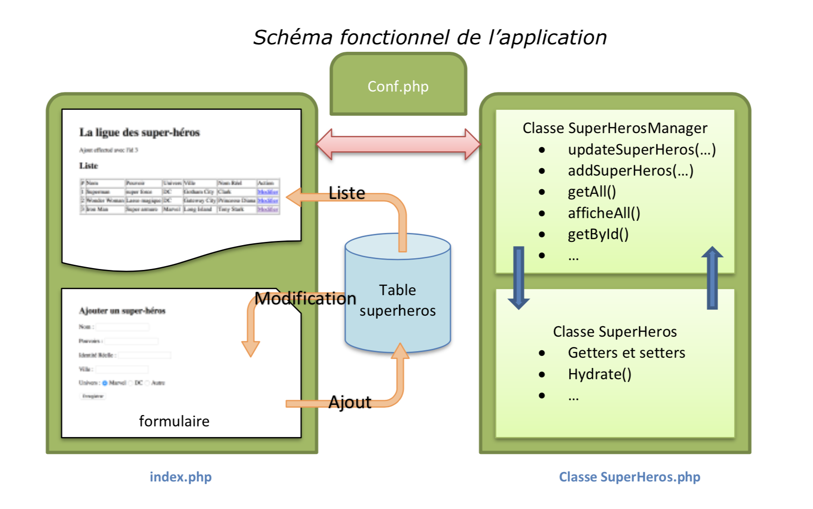

# Séance 10


### Notation

Cet exercice sera à faire valider en fin de séance **obligatoirement**.

* 0, rien n'est fait
* 1, début d'exercice, mais non fonctionnel
* 2, TP réalisé exactement comme demandé
* 3, TP réalisé avec quelques améliorations/optimisations


## Sujet

Rédiger les classes permettant la gestion des Personnages et des Attributs dans une base de données. Nous allons passer par des "_manager_" \(ce terme est en référence au langage de nombreux framework\), qui vont faire l'intermédiaire entre la classe Personnage \(ou Attribut\) et la base de données.

En d'autres termes, la classe Personnage, ne contiendra que ce qui permet de manipuler un Personnage \(getters, setters, méthodes spécifiques\), et la classe PersonnageManager permettra les accès à la base de données et retournera un ou plusieurs objet Artiste en fonction des requêtes.

### A disposition

* Un fichier seance10.sql à intégrer dans votre base de données.


```sql
CREATE TABLE `Personnage` (
  `id` int(11) NOT NULL AUTO_INCREMENT,
  `typePersonnage` varchar(30) NOT NULL,
  `nbPtDeVie` int(11) NOT NULL,
  `nbPtDeForce` int(11) NOT NULL,
  `x` int(11) NOT NULL,
  `y` int(11) NOT NULL,
  `attributs` text NOT NULL
) ENGINE=MyISAM DEFAULT CHARSET=utf8;

--
-- Index pour les tables déchargées
--

--
-- Index pour la table `Personnage`
--
ALTER TABLE `Personnage`
  ADD PRIMARY KEY (`id`);
```


* Un fichier seance10.php à tester


```php
<!doctype html>
<html lang="fr">
<head>
  <meta charset="UTF-8">
  <meta name="viewport" content="width=device-width, user-scalable=no, initial-scale=1.0, maximum-scale=1.0, minimum-scale=1.0">
  <meta http-equiv="X-UA-Compatible" content="ie=edge">
  <link rel="stylesheet" href="assets/styles.css">

  <title>Séance 10</title>
</head>
<body>
<?php
spl_autoload_register(function ($class_name) {
    require $class_name . '.php';
});

$pm = new PersonnageManager('localhost', 'root', 'root', 'm3203');
$perso1 = new Gobelin();
$perso1->place(2, 3);

$id = $pm->addPersonnage($perso1);
echo '<p>Personnage ajouté avec l\'id numéro '.$id.'</p>';

$perso2 = $pm->getById($id);
Affichage::addPersonnage($perso2);
Affichage::affichePlateau();

$perso3 = new Elfe();
$perso3->place(5, 7);
$att1 = new Magie('Invisibilité', 15, 15);
$att2 = new Magie('Feu', 0,30);

$perso3->addAttribut($att1);
$perso3->addAttribut($att2);
$id = $pm->addPersonnage($perso3);
echo '<p>Personnage ajouté avec l\'id numéro '.$id.'</p>';

$perso4 = $pm->getById($id);
Affichage::addPersonnage($perso4);
echo $perso4->afficherAttributs();
Affichage::affichePlateau();
?>
</body>
</html>

```



**Vous devez faire valider le bon fonctionnement en fin de séance**


### Quelques explications sur l'Autoloader

Vous constaterez que nous n'avons pas de "require" pour chacune des classes dans le fichier seance10.php, pour autant vos classes seront accessibles. On utilise le mécanisme d'autoload de PHP qui permet d'éviter d'avoir des requires quand on utilise la POO. Cela s'avère très pratique quand nous avons beaucoup de classes à gérer.

```php
spl_autoload_register(function ($class_name) {
    require $class_name . '.php';
});
```

Le code ci-dessus assure le lien avec tous les fichiers nécessaires. En fait, à chaque fois que vous aller utiliser une classe \(new Classe ou Classe::...\), PHP, va essayer de trouver un fichier qui se nomme Classe.php et automatiquement en faire un require pour l'intégrer.

Contrainte de cette solution, vous devez avoir un fichier par classe, et votre fichier doit se nommer exactement comme votre classe. Mais nous avons vu en cours, que cette contrainte est en fait une bonne pratique. 

### A faire

Nous allons concevoir le Manger pour la classe Personnage \(et de ces enfants\) uniquement dans ce TP.

Le schéma ci-dessous, illustre, sur un autre exemple, le principe que nous souhaitons mettre en place.



#### La classe PersonnageManager

La classe Personnagemanager contiendra les méthodes suivantes :

* `addPersonnage($personnage)` : L’argument de cette méthode est une instance de la classe Personnage \(ou de ses filles\). Elle génère une requête `‘INSERT INTO...’` et l’exécute. Elle permet l’ajout d'un Artiste dans la table. Cette méthode retourne le dernier id inséré \([lastInsertId](http://php.net/manual/fr/pdo.lastinsertid.php)\) 
* `getById($id)` : L’argument permet de sélectionner l’enregistrement que l’utilisateur de l’application souhaite modifier. Elle est donc appelée par l’application. Cette méthode retourne une instance de la classe Personnage dont les propriétés sont initialisées avec les valeurs du Personnage sélectionné.   
* `getAll()` : Cette méthode construit un tableau contenant tous les Personnages de la table. Chaque élément du tableau est une instance de la classe Personnage dont les propriétés sont issues de chaque enregistrement de la table Personnage.  

La classe PersonnageManager contiendra une propriété privée qui est la connexion à la base de données. Cette connexion sera initialisée par le constructeur.

### Quelques éléments

#### Méthode addPersonnage

Comme la propriété attributs est un tableau d'objet, on doit utiliser le concept de serialization qui permet de transformer un objet \(ou un tableau\), en une chaîne de caractères. Pour utiliser et stocker ce résultat dans la BDD, il faut écrire la requête en utilisation la "préparation" et non le code SQL plus classique \(problème d'incompatibilité entre la chaîne produite et la syntaxe\).

Le code de la requête d'insertion pourrait donc être :

```php
$sth = $this->db->prepare('INSERT INTO Personnage (typePersonnage, nbPtDeVie, nbPtDeForce, x, y, attributs) VALUES (:getTypePersonnage, :getNbPtDeVie, :getForce, :getX, :getY, :attributs);');
$sth->execute([
    ':getTypePersonnage' => $personnage->getTypePersonnage(),
    ':getNbPtDeVie' => $personnage->getNbPtDeVie(),
    ':getForce' => $personnage->getForce(),
    ':getX' => $personnage->getX(),
    ':getY' => $personnage->getY(),
    ':attributs' => serialize($personnage->getAttributs())
]);
```

#### Méthode getById

Cette méthode doit récupérer un enregistrement en fonction de l'id.

Cet enregistrement peut, par construction être un Humain, un Efle ou un Gobelin. il faudra donc veiller à créer le bon objet selon le type de personnage.

Pour récupérer les données des attributs \(qui ont été sérializé\), vous pouvez utiliser la syntaxe suivante :

```php
$personnage->setAttributs(unserialize($data['attributs'], [true]));
```

### Travail à Faire

* Ecrire la classe PersonnageManager
* Faire fonctionner la classe PersonnageManager avec le fichier seance10.php

