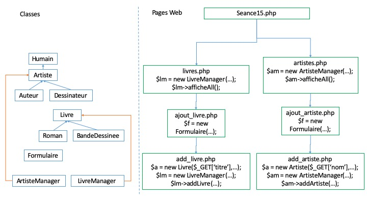

# Description générale

Dans cette seconde partie du module M3203 de programmation orientée objet, nous allons mettre en place un système complet permettant de gérer une collection de livre.

Cet exemple est minimaliste et pourrait être améliorer. Cependant il reprend la logique que vous verrez dans le module de M3202 avec l'utilisation d'un framework web.

