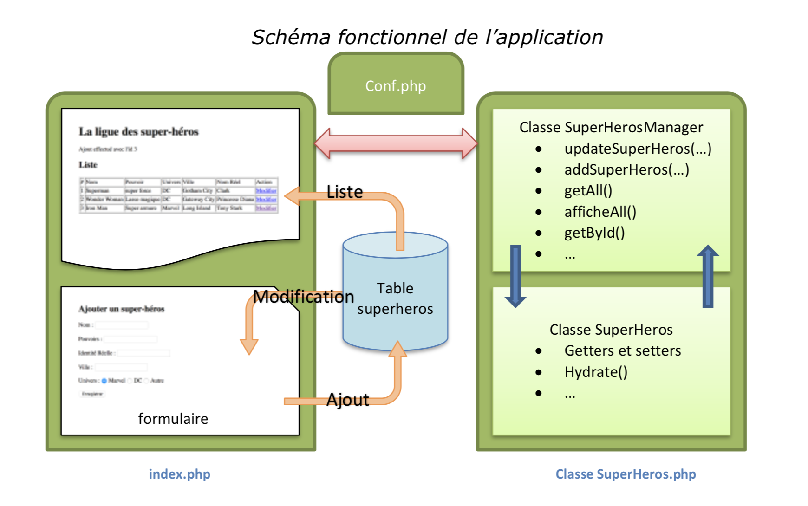

# Séance 12 : Utilisation d'une base de données

Nous allons exploiter les classes des [Séance 9 : Structure de base](seance-9.md), [Séance 10 : Génération de formulaire en POO](seance-10.md) et [Séance 11 : Traitement des formulaires pour nos livres et auteurs](seance-11.md)


### Notation

Cet exercice sera à faire valider en fin de séance **obligatoirement**.

* 0, rien n'est fait
* 1, début d'exercice, mais non fonctionnel
* 2, TP réalisé exactement comme demandé
* 3, TP réalisé avec quelques améliorations/optimisations


## Sujet

Rédiger les classes permettant la gestion des Artistes et des Livres dans une base de données. Nous allons passer par des "_manager_" \(ce terme est en référence au langage de nombreux framework\), qui vont faire l'intermédiaire entre la classe Artiste et la base de données.

En d'autres termes, la classe Artiste, ne contiendra que ce qui permet de manipuler un Artiste \(getters, setters, méthodes spécifiques\), et la classe ArtisteManager permettra les accès à la base de données et retournera un ou plusieurs objet Artiste en fonction des requêtes.

### A disposition

* Un fichier seance12.sql à intégrer dans votre base de données.


```sql
CREATE TABLE `Artiste` (
  `id` int(11) NOT NULL,
  `nom` varchar(50) NOT NULL,
  `prenom` varchar(50) NOT NULL,
  `image` varchar(50) NOT NULL,
  `datenaissance` varchar(20) NOT NULL,
  `specialite` varchar(50) NOT NULL
) ENGINE=MyISAM DEFAULT CHARSET=utf8;
ALTER TABLE `Artiste` ADD PRIMARY KEY (`id`);
ALTER TABLE `Artiste` MODIFY `id` int(11) NOT NULL AUTO_INCREMENT;
```


* Un fichier seance12.php à tester


```php
<!DOCTYPE html>
<html lang="en">
<head>
    <meta charset="UTF-8">
    <title>Seance 12 - Manipulation de base de données</title>
</head>
<body>
<h1>Manipulation de base de données et d'Artiste</h1>
<?php
    include 'interfaces.php';
    include 'Humain.php';
    include 'Artiste.php';
    include 'ArtisteManager.php';
    $am = new ArtisteManager('localhost', 'root', 'root', 'm3203');
    $artiste = new Artiste(array('nom' => 'Conan Doyle', 'prenom' => 'Arthur', 'datenaissance' => '01/01/1800', 'specialite' => 'Auteur', 'image' => 'doyle.jpg'));
    $id = $am->addArtiste($artiste);
    echo '<p>Artiste ajouté avec l\'id numéro '.$id.'</p>';
    $artiste2 = $am->getById($id);
    echo '<p>'.$artiste2->sePresente().'</p>';
?>
<h1>Affichage de tous les artistes</h1>
<?php
    echo $am->afficheAll();
?>
</body>
</html>

```



**Vous devez faire valider le bon fonctionnement en fin de séance**


### A faire

Nous allons concevoir le Manger pour la classe Artiste uniquement dans ce TP.

Le schéma ci-dessous, illustre, sur un autre exemple, le principe que nous souhaitons mettre en place.



#### La classe ArtisteManager

La classe ArtisteManager contiendra les méthodes suivantes :

* `addArtiste(Artiste $artiste)` : L’argument de cette méthode est une instance de la classe Artiste. Elle génère une requête `‘INSERT INTO...’` et l’exécute. Elle permet l’ajout d'un Artiste dans la table. Cette méthode retourne le dernier id inséré \([lastInsertId](http://php.net/manual/fr/pdo.lastinsertid.php)\) 
* `getById($id)` : L’argument permet de sélectionner l’enregistrement que l’utilisateur de l’application souhaite modifier. Elle est donc appelée par l’application. Cette méthode retourne une instance de la classe Artiste dont les propriétés sont initialisées avec les valeurs de l'Artiste sélectionné.   
* `updateArtiste(Artiste $sh)` : L’argument de cette méthode est une instance de la classe Artiste. Elle génère une requête `‘UPDATE ...’` et l’exécute. Elle permet la modification de l’enregistrement concerné.  
* `getAll()` : Cette méthode construit un tableau contenant tous les Artiste de la table. Chaque élément du tableau est une instance de la classe Artiste dont les propriétés sont issues de chaque enregistrement de la table Artiste.  
* `afficheAll()` Cette méthode appelle la méthode `getAll()`. Elle génère un tableau HTML à partir du tableau d'Artiste issu de la fonction `getAll()`. Les propriétés de chaque Artiste sont issues des getters de la classe Artiste. Un lien hypertexte \(dernière colonne du tableau\) permettra d’appeler le formulaire de modification \(`$_GET['id']`\) 

La classe ArtisteManager contiendra une propriété privée qui est la connexion à la base de données. Cette connexion sera initialisée par le constructeur.


## Astuce

Comme vous le constatez la classe ArtisteManager doit créer des objets Artiste. On pourrait facilement exploiter les Setters de chacune des propriétés pour remplir un objet Artiste en fonction des données issues d'une requête. Cela se fait très bien, si notre objet possède 2 ou 3 propriétés. Mais l'opération devient plus fastidieuse lorsque l'on a beaucoup de propriété.

Pour palier à cela, on exploite souvent une méthode dite **d'hydratation** qui permet de remplir un objet en fonction d'un tableau associatif. En fait ce tableau comporte comme clé, le nom de la propriété que l'on souhaite initialiser, et comme valeur, la valeur issue de la base de données pr exemple.

La méthode hydrate va essayer de construire les setters associés à chacune de ces clés. Et l'utiliser pour sauvegarder la valeur. Si de manière judicieuse les champs de la table sont nommés de la même manière que les propriétés, il devient assez simple de construire une méthode qui fait le lien entre la table et l'objet de manière générique.

le code de l'hydratation pourrait ressembler au code ci-dessous:

```php
public function hydrate(array $donnees) 
{     
  foreach ($donnees as $key => $value)     
  {         
    $method = 'set'.ucfirst($key);          
    if (method_exists($this, $method))         
    {             
      $this->$method($value);         
    }    
  }
}
```

La boucle parcourt le tableau `$donnees`. Il s’agit d’un tableau associatif. Le nom de chaque enregistrement est le nom de chaque propriété du super héros `(id, nom, prenom, datenaissance, image, specialite)`. La variable `$method` est une chaîne de caractères correspondant à un setter. Si la méthode ainsi générée existe, elle est appelée : `$this->$method($value)`.  
L’intérêt de cette technique est de simplifier le code en le réduisant le nombre d’instructions.

* Constructeur : est tout simplement un appel de la fonction Hydrate. 
* Update\(\) est une méthode qui appelle la méthode hydrate pour mettre à jour un objet


### La classe Artiste et Humain

Avec cette nouvelle approche, il faut modifier la classe Artiste et la classe Humain.

Il faut d'abord s'assurer d'avoir tous les setters pour les différentes propriétés. Ensuite, si vous étudiez le fichier seance12.php, vous devez remarquer que l'appel du constructeur d'Artiste est différent. Il n'utilise plus qu'un seul paramètre. Ce paramètre est un tableau associatif. Il est donc possible d'utiliser l'une des deux approches ci-dessous

#### Sans passer par la méthode hydrate

```php
class Artiste
{
    ...
    public function __construct($donnees)
    {
        parent::__construct($donnees['nom'], $donnees['prenom'], $donnees['datenaissance'])
        $this->image = $donnees['image'];
        $this->specialite = $donnees['specialite'];
    }
    ...
}
```

Cette solution est rapide à mettre en place et n'implique pas forcément d'avoir tous les setters. Elle n'implique pas non plus de bien comprendre le concept d'hydratation. Chaque paramètre précédent est remplacé par son équivalent dans le tableau.


**Faites attentions aux dénominations ! Elles ne sont pas forcément identiques à votre code** 


#### Avec la méthode hydrate

```php
class Artiste
{
    ...
    public function __construct($donnees)
    {
        $this->hydrate($donnees);
    }
    ...
}
```

Cette solution utilise l'hydratation \(**Il faut placer la méthode au bon endroit**\), et implique d'avoir les setters pour toutes les propriétés \(**n'oubliez pas les parents**\).


**Notez que cette méthode n'utilise plus l'appel à parent::\_\_construct\(...\), puisque l'hydrate passe par les setters.**


### Travail à Faire

* Ecrire la classe ArtisteManager
* Modifier et adapter votre classe Artiste \(faite une copie de la classe fonctionnelle\)
* Faire fonctionner la classe ArtisteManager avec le fichier [seance12.php](tp8.php)

### Pour Aller plus loin

Comment pourriez vous gérer les Auteurs et les Dessinateurs ?

